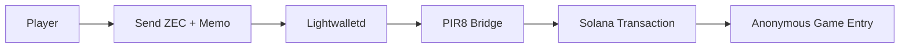

# 🔒 PIR8 Zcash Privacy Integration Setup (2026)

PIR8 is the **first blockchain strategy game** with cross-chain privacy features, allowing players to join battles anonymously via Zcash while playing on Solana's high-speed network.

## 🚀 Quick Setup

### 1. Environment Configuration

Add these variables to your `.env.local` file:

```bash
# Zcash Privacy Integration
NEXT_PUBLIC_LIGHTWALLETD_URL=https://lightwalletd.com:9067
NEXT_PUBLIC_ZCASH_SHIELDED_ADDR=zs1your_shielded_address_here
NEXT_PUBLIC_ZCASH_ENABLED=true
NEXT_PUBLIC_LOG_LEVEL=info
```

### 2. Get a Zcash Shielded Address

**Option A: Use Zashi Wallet (Recommended for 2026)**
1. Download [Zashi](https://zashi.tech/) - the official Zcash wallet
2. Create a new shielded address (starts with `zs1...`)
3. Copy the address to `NEXT_PUBLIC_ZCASH_SHIELDED_ADDR`

**Option B: Use zcashd CLI**
```bash
zcash-cli z_getnewaddress sapling
```

### 3. Test the Integration

```bash
pnpm run test:zcash
```

You should see:
```
🟢 Zcash integration is READY for production!
   - Configuration complete
   - Privacy features enabled
   - Cross-chain bridge active
```

## 🎮 How Privacy Gaming Works

### For Players

1. **Public Entry** (Standard): Connect Solana wallet → Join game
2. **Private Entry** (Premium): Send Zcash with memo → Join anonymously

### Private Entry Flow



### Example Private Entry

1. Send 0.01 ZEC to: `zs1your_shielded_address_here`
2. Include this memo:
```json
{
  "v": "1",
  "gameId": "global_game", 
  "action": "join",
  "solanaPubkey": "9WzDXwBbmkg8ZTbNMqUxvQRAyrZzDsGYdLVL9zYtAWWM",
  "timestamp": 1769508047090,
  "metadata": {}
}
```
3. PIR8 automatically detects the memo and joins you to the game
4. Your Zcash identity never appears on Solana

## 🔧 Technical Architecture

### Components

- **LightwalletdWatcher**: Monitors Zcash blockchain for incoming memos
- **ZcashMemoBridge**: Parses and validates memo format
- **joinGamePrivateViaZcash**: Executes Solana transaction with player from memo
- **useZcashBridge**: React hook managing connection lifecycle

### Security Features

- ✅ Memo validation (schema, freshness, format)
- ✅ Graceful fallbacks (works without Zcash)
- ✅ Cross-chain audit trail
- ✅ No identity linkage between chains

## 🌐 Production Deployment

### Mainnet Configuration

```bash
# Production Zcash Mainnet
NEXT_PUBLIC_LIGHTWALLETD_URL=https://mainnet.lightwalletd.com:9067
NEXT_PUBLIC_ZCASH_SHIELDED_ADDR=zs1your_mainnet_address
NEXT_PUBLIC_ZCASH_ENABLED=true
```

### Testnet Configuration

```bash
# Testnet for Development
NEXT_PUBLIC_LIGHTWALLETD_URL=https://testnet.lightwalletd.com:9067
NEXT_PUBLIC_ZCASH_SHIELDED_ADDR=zs1your_testnet_address
NEXT_PUBLIC_ZCASH_ENABLED=true
```

## 🎯 Marketing Advantages

### Unique Selling Points

1. **First Privacy-Enabled Strategy Game**: No other blockchain game offers cross-chain privacy
2. **Strategic Privacy**: Hide your moves from opponents until execution
3. **Cross-Chain Innovation**: Combines Solana speed with Zcash privacy
4. **Optional Privacy**: Players choose public or private entry

### Target Audiences

- **Privacy Advocates**: Users who value financial privacy
- **Strategy Gamers**: Players who want hidden information games
- **Crypto Enthusiasts**: Early adopters of cross-chain tech
- **Zcash Community**: Underserved market looking for Zcash utility

## 🚨 Troubleshooting

### Common Issues

**"Lightwalletd connection failed"**
- Check `NEXT_PUBLIC_LIGHTWALLETD_URL` is correct
- Verify network connectivity
- Try alternative Lightwalletd servers

**"Shielded address not configured"**
- Set `NEXT_PUBLIC_ZCASH_SHIELDED_ADDR` in `.env.local`
- Ensure address starts with `zs1...`

**"Zcash integration disabled"**
- Set `NEXT_PUBLIC_ZCASH_ENABLED=true`
- Restart development server

### Debug Mode

```bash
NEXT_PUBLIC_LOG_LEVEL=debug pnpm run dev
```

## 📈 2026 Zcash Ecosystem

By 2026, Zcash has matured significantly:
- ✅ Stable Lightwalletd infrastructure
- ✅ Mobile wallet adoption (Zashi, etc.)
- ✅ Cross-chain bridge protocols
- ✅ Regulatory clarity for privacy coins
- ✅ Enterprise privacy solutions

PIR8 leverages this mature ecosystem to offer **the first privacy-enabled blockchain strategy game**.

---

**Ready to launch the future of private gaming? 🏴‍☠️**